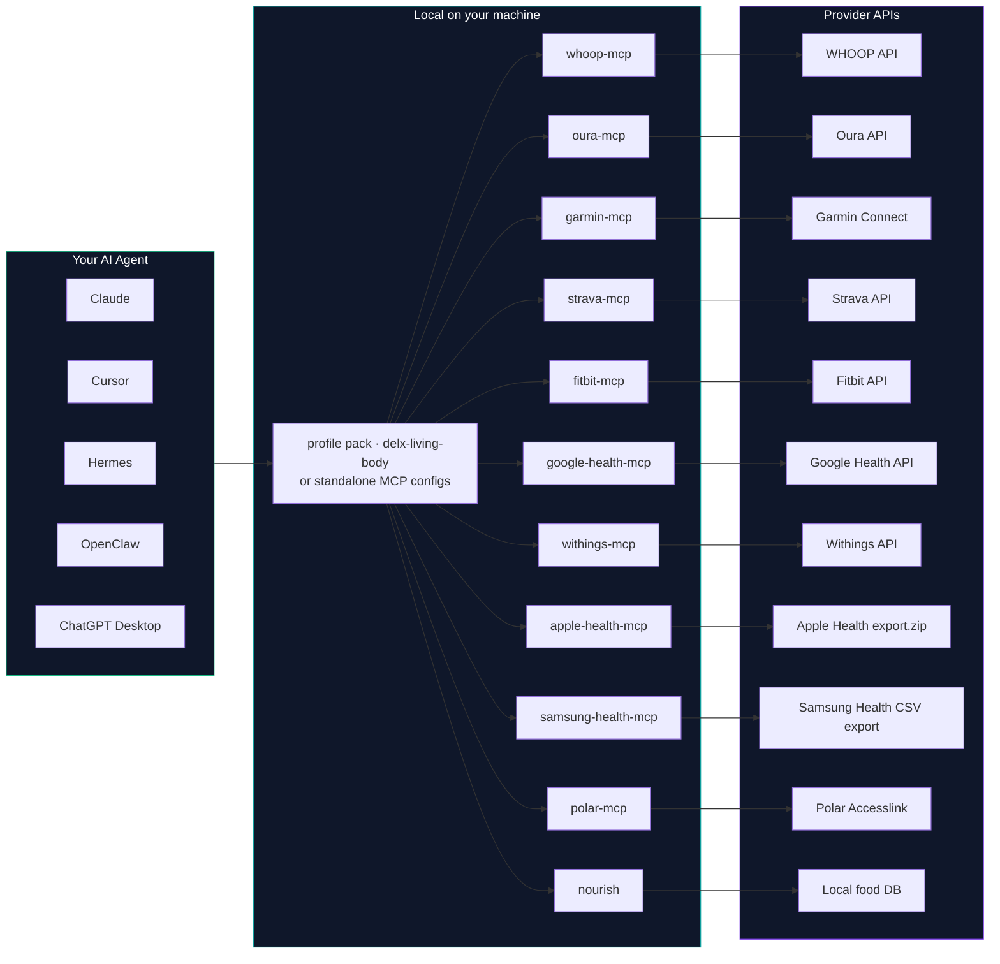

<h1 align="center">Delx Wellness</h1>

<div align="center">
  
</div>

<h3 align="center">
  Open-source MCP connectors for wearables, recovery, training and nutrition.<br>
  Give your AI agent your sleep, HRV, workouts and food &mdash; all local-first, all read-only.
</h3>

<p align="center">
  <a href="https://wellness.delx.ai"></a>
  <a href="https://github.com/davidmosiah/delx-wellness-hermes"></a>
  <a href="https://github.com/davidmosiah/delx-wellness-openclaw"></a>
  <a href="https://modelcontextprotocol.io"></a>
  <a href="LICENSE"></a>
</p>

<p align="center">
  <a href="https://github.com/davidmosiah/delx-wellness/stargazers"></a>
  <a href="https://www.npmjs.com/~davidmosiah"></a>
  <a href="https://github.com/davidmosiah/delx-wellness/discussions"></a>
  <a href="https://x.com/delx369"></a>
</p>

<p align="center">
  <strong>What is this?</strong> A registry of <strong>open-source MCP servers</strong> that turn your wearables, nutrition, room air quality, menstrual cycle, continuous glucose and smart mattress into context any AI agent can read &mdash; with zero data ever leaving your machine.
</p>

<p align="center">
  
</p>

<p align="center">
  ⭐ <strong>If this helps your agent workflow, star this hub.</strong><br>
  <em>Stars make the connector map easier for AI builders to find, and this is the canonical repo for the Delx Wellness ecosystem.</em>
</p>

---

## Start here

| Goal | Use this | Command |
|---|---|---|
| **One MCP that pulls in all the others** (Claude Desktop, Cursor, Goose, any generic client) | [`delx-living-body`](https://github.com/davidmosiah/delx-living-body) | `npx -y delx-living-body` |
| Install the whole wellness stack for Hermes | [`delx-wellness-hermes`](https://github.com/davidmosiah/delx-wellness-hermes) | `npx -y delx-wellness-hermes setup` |
| Install the whole wellness stack for OpenClaw | [`delx-wellness-openclaw`](https://github.com/davidmosiah/delx-wellness-openclaw) | `npx -y delx-wellness-openclaw setup` |
| Track food, barcode scans, hydration and meal summaries | [`wellness-nourish`](https://github.com/davidmosiah/wellness-nourish) | `npx -y wellness-nourish doctor` |
| Add recovery, strain, sleep and HRV | [`whoop-mcp`](https://github.com/davidmosiah/whoop-mcp) | `npx -y whoop-mcp-unofficial setup` |
| Add Body Battery, sleep, stress and training readiness | [`garminmcp`](https://github.com/davidmosiah/garminmcp) | `npx -y garmin-mcp-unofficial setup --auth` |
| Copy runnable agent templates | [`delx-agent-workbench`](https://github.com/davidmosiah/delx-agent-workbench) | Use the Hermes, OpenClaw, Claude Desktop or Codex examples |
| Browse the human-friendly site | [`delx-wellness-site`](https://github.com/davidmosiah/delx-wellness-site) | [wellness.delx.ai](https://wellness.delx.ai) |

**Generic MCP clients (Claude Desktop, Cursor, Goose, ChatGPT Desktop):** the lowest-friction option is [`delx-living-body`](https://github.com/davidmosiah/delx-living-body) — a single meta-MCP that **auto-detects whichever connectors you already have installed** and composes them into one unified surface (`living_body_status`, `living_body_daily_brief`, `living_body_ask`, `living_body_health_check`). One server entry instead of a dozen; synthesis is rule-based and offline.

Agents should start with `agent_manifest`, `connection_status` or `capabilities` when a connector exposes them (or `living_body_status` when running the meta-MCP). Humans should start with the Hermes or OpenClaw profile packs when they want the whole stack installed as one local-first wellness agent.

For the public thesis behind this stack, read [Why local-first wellness agents need MCP](https://github.com/davidmosiah/davidmosiah/blob/main/docs/local-first-wellness-agents.md).

---

## 🔑 Auth & what runs offline

Each connector handles its own credentials locally — nothing is shared with the MCP client and no token ever leaves your machine. Use this to pick the connectors you can stand up fastest.

> ⚡ **Zero-credential quick start:** **Nourish** and **Cycle Coach** run with no login at all — install one and you have a working tool in ~30 seconds. Start there to feel the workflow before wiring up OAuth providers.

| Provider | Auth type | What to have on hand | Runs offline? |
|---|---|---|---|
| **Nourish** | None (optional USDA API key) | Nothing — public food data + local intake logs | ✅ Yes |
| **Cycle Coach** | None (stateless) | Nothing — pass cycle history per call | ✅ Yes |
| **Apple Health** | Local export file | `export.zip` / `export.xml` from the Health app | ✅ Yes (offline file) |
| **Samsung Health** | Local export file | Samsung Health CSV/ZIP export folder | ✅ Yes (offline file) |
| **Air** | API key *or* local IP | AirGradient API key, or the device's LAN IP | ✅ Yes (local-only mode) |
| **WHOOP** | OAuth 2.0 | Your own WHOOP app `client_id` / `secret` | ☁️ Provider API |
| **Oura** | OAuth 2.0 | Your own Oura app credentials | ☁️ Provider API |
| **Fitbit** | OAuth 2.0 | Your own Fitbit app credentials | ☁️ Provider API |
| **Strava** | OAuth 2.0 | Your own Strava app credentials | ☁️ Provider API |
| **Withings** | OAuth 2.0 (signed) | Your own Withings app credentials | ☁️ Provider API |
| **Polar** | OAuth 2.0 | Your own Polar AccessLink client credentials | ☁️ Provider API |
| **Google Health** | Google OAuth 2.0 | Your own Google Cloud OAuth client | ☁️ Provider API |
| **Garmin** | Local personal-token mode | Garmin Connect login (local helper) | ☁️ Provider API (unofficial) |
| **Eight Sleep** | Mobile-app password grant | Your Eight Sleep email + password | ☁️ Provider API (unofficial) |
| **CGM (Dexcom)** | OAuth 2.0 *or* sandbox | Dexcom credentials, or use sandbox mode | ☁️ Provider API (sandbox offline) |

<sub>OAuth completes locally and refresh tokens live in your OS keychain or a `~/.config` file you own. The MCP client never sees a secret; tools never return one. Full auth detail per connector: [`registry.json`](registry.json).</sub>

---

## 🧭 Which connector should I install first?

```text
Have a WHOOP?               → start with whoop-mcp         (recovery, HRV, sleep, strain)
Have a Garmin?              → start with garminmcp         (Body Battery, training readiness, HRV)
Have an Oura?              → start with ouramcp          (readiness, sleep, activity, HRV)
Have an Eight Sleep?       → start with eight-sleep-mcp   (sleep trends, bed temperature, alarms)
Have Withings devices?     → start with withingsmcp      (body measures, sleep, activity, heart)
Have an Apple Health export?→ add apple-health-mcp       (local export activity, sleep, HRV, workouts)
Have a Galaxy Watch export? → add samsung-health-mcp     (local CSV activity, sleep, HRV, workouts)
Have a Polar device?       → start with polarmcp         (Nightly Recharge, training load, PPI/HRV)
Run/ride/swim a lot?       → add strava-mcp              (activities, streams, routes)
Just bought a Fitbit?      → add fitbitmcp               (activity, sleep, heart, HRV)
Migrating Fitbit to Google?→ add google-health-mcp       (Google Health API v4, rollups, reconciled streams)
Tracking food?             → add wellness-nourish        (food search, barcode lookup, intake, hydration)
Tracking glucose?          → add wellness-cgm-mcp        (Dexcom glucose, time-in-range, meal response)
Tracking a menstrual cycle?→ add wellness-cycle-coach    (phase detection, phase nutrition & training)
Care about room air?       → add wellness-air            (AQI, PM2.5, CO₂ — pair with sleep data)
Multiple devices?          → install several. Each is independent and read-only.
Want one entry for all?    → add delx-living-body        (auto-detects the above; one unified surface)
```

The connectors are designed to coexist. When two providers cover the same signal (e.g. WHOOP and Garmin both report sleep), each tool returns provider-tagged data and your agent reconciles them.

> Don't want to choose? Run [`delx-living-body`](https://github.com/davidmosiah/delx-living-body) — it auto-detects whichever of the connectors below you've installed and exposes a single `living_body_daily_brief` over all of them.

---

## ✨ The connectors

<table>
  <tr>
    <td width="33%" align="center" valign="top">
      <a href="https://github.com/davidmosiah/whoop-mcp">
        <br>
      </a>
      <code>whoop-mcp-unofficial</code><br>
      <sub>Recovery · HRV · Sleep · Strain</sub><br><br>
      <a href="https://github.com/davidmosiah/whoop-mcp"></a>
      <a href="https://www.npmjs.com/package/whoop-mcp-unofficial"></a>
    </td>
    <td width="33%" align="center" valign="top">
      <a href="https://github.com/davidmosiah/ouramcp">
        <br>
      </a>
      <code>oura-mcp-unofficial</code><br>
      <sub>Readiness · Sleep · Activity · HRV</sub><br><br>
      <a href="https://github.com/davidmosiah/ouramcp"></a>
      <a href="https://www.npmjs.com/package/oura-mcp-unofficial"></a>
    </td>
    <td width="33%" align="center" valign="top">
      <a href="https://github.com/davidmosiah/garminmcp">
        <br>
      </a>
      <code>garmin-mcp-unofficial</code><br>
      <sub>Body Battery · Training Readiness · HRV</sub><br><br>
      <a href="https://github.com/davidmosiah/garminmcp"></a>
      <a href="https://www.npmjs.com/package/garmin-mcp-unofficial"></a>
    </td>
  </tr>
  <tr>
    <td width="33%" align="center" valign="top">
      <a href="https://github.com/davidmosiah/strava-mcp">
        <br>
      </a>
      <code>strava-mcp-unofficial</code><br>
      <sub>Activities · Streams · Routes · Segments</sub><br><br>
      <a href="https://github.com/davidmosiah/strava-mcp"></a>
      <a href="https://www.npmjs.com/package/strava-mcp-unofficial"></a>
    </td>
    <td width="33%" align="center" valign="top">
      <a href="https://github.com/davidmosiah/fitbitmcp">
        <br>
      </a>
      <code>fitbit-mcp-unofficial</code><br>
      <sub>Activity · Sleep · Heart · HRV</sub><br><br>
      <a href="https://github.com/davidmosiah/fitbitmcp"></a>
      <a href="https://www.npmjs.com/package/fitbit-mcp-unofficial"></a>
    </td>
    <td width="33%" align="center" valign="top">
      <a href="https://github.com/davidmosiah/withingsmcp">
        <br>
      </a>
      <code>withings-mcp-unofficial</code><br>
      <sub>Body Measures · Sleep · Activity · Heart</sub><br><br>
      <a href="https://github.com/davidmosiah/withingsmcp"></a>
      <a href="https://www.npmjs.com/package/withings-mcp-unofficial"></a>
    </td>
  </tr>
  <tr>
    <td width="33%" align="center" valign="top">
      <a href="https://github.com/davidmosiah/apple-health-mcp">
        <br>
      </a>
      <code>apple-health-mcp-unofficial</code><br>
      <sub>Local export · Activity · Sleep · HRV · Workouts</sub><br><br>
      <a href="https://github.com/davidmosiah/apple-health-mcp"></a>
      <a href="https://www.npmjs.com/package/apple-health-mcp-unofficial"></a>
    </td>
    <td width="33%" align="center" valign="top">
      <a href="https://github.com/davidmosiah/samsung-health-mcp">
        <br>
      </a>
      <code>samsung-health-mcp-unofficial</code><br>
      <sub>Galaxy Watch export · Sleep · HRV · Workouts</sub><br><br>
      <a href="https://github.com/davidmosiah/samsung-health-mcp"></a>
      <a href="https://www.npmjs.com/package/samsung-health-mcp-unofficial"></a>
    </td>
    <td width="33%" align="center" valign="top">
      <a href="https://github.com/davidmosiah/polarmcp">
        <br>
      </a>
      <code>polar-mcp-unofficial</code><br>
      <sub>Nightly Recharge · Training Load · PPI / HRV</sub><br><br>
      <a href="https://github.com/davidmosiah/polarmcp"></a>
      <a href="https://www.npmjs.com/package/polar-mcp-unofficial"></a>
    </td>
  </tr>
  <tr>
    <td width="33%" align="center" valign="top">
      <a href="https://github.com/davidmosiah/google-health-mcp">
        <br>
      </a>
      <code>google-health-mcp-unofficial</code><br>
      <sub>Google Health API v4 · Fitbit migration · Rollups</sub><br><br>
      <a href="https://github.com/davidmosiah/google-health-mcp"></a>
      <a href="https://www.npmjs.com/package/google-health-mcp-unofficial"></a>
    </td>
    <td width="33%" align="center" valign="top">
      <a href="https://github.com/davidmosiah/eight-sleep-mcp">
        <br>
      </a>
      <code>eight-sleep-mcp-unofficial</code><br>
      <sub>Sleep trends · Bed temperature · Alarms</sub><br><br>
      <a href="https://github.com/davidmosiah/eight-sleep-mcp"></a>
      <a href="https://www.npmjs.com/package/eight-sleep-mcp-unofficial"></a>
    </td>
    <td width="33%" align="center" valign="top">
      <a href="https://github.com/davidmosiah/wellness-nourish">
        <br>
      </a>
      <code>wellness-nourish</code><br>
      <sub>Food search · Barcodes · Intake · Hydration · Local</sub><br><br>
      <a href="https://github.com/davidmosiah/wellness-nourish"></a>
      <a href="https://www.npmjs.com/package/wellness-nourish"></a>
    </td>
  </tr>
  <tr>
    <td width="33%" align="center" valign="top">
      <a href="https://github.com/davidmosiah/wellness-air">
        <br>
      </a>
      <code>wellness-air</code><br>
      <sub>AirGradient · AQI · PM2.5 · CO₂ · Room quality</sub><br><br>
      <a href="https://github.com/davidmosiah/wellness-air"></a>
      <a href="https://www.npmjs.com/package/wellness-air"></a>
    </td>
    <td width="33%" align="center" valign="top">
      <a href="https://github.com/davidmosiah/wellness-cycle-coach">
        <br>
      </a>
      <code>wellness-cycle-coach</code><br>
      <sub>Menstrual phase · Nutrition · Training · Stateless</sub><br><br>
      <a href="https://github.com/davidmosiah/wellness-cycle-coach"></a>
      <a href="https://www.npmjs.com/package/wellness-cycle-coach"></a>
    </td>
    <td width="33%" align="center" valign="top">
      <a href="https://github.com/davidmosiah/wellness-cgm-mcp">
        <br>
      </a>
      <code>wellness-cgm-mcp</code><br>
      <sub>Dexcom · Glucose · TIR · GMI · Meal response</sub><br><br>
      <a href="https://github.com/davidmosiah/wellness-cgm-mcp"></a>
      <a href="https://www.npmjs.com/package/wellness-cgm-mcp"></a>
    </td>
  </tr>
  <tr>
    <td width="33%" align="center" valign="top">
      <a href="https://github.com/davidmosiah/delx-living-body">
        <br>
      </a>
      <code>delx-living-body</code><br>
      <sub>Meta-MCP · Auto-detect · One unified surface</sub><br><br>
      <a href="https://github.com/davidmosiah/delx-living-body"></a>
      <a href="https://www.npmjs.com/package/delx-living-body"></a>
    </td>
    <td width="33%" align="center" valign="top">
      <em>More connectors coming &mdash;<br>follow on <a href="https://x.com/delx369">X</a> for releases.</em>
    </td>
    <td width="33%" align="center" valign="top">
    </td>
  </tr>
</table>

> Each connector is a standalone npm package. Install one or all of them &mdash; they coexist and the agent reconciles overlapping signals (WHOOP, Garmin, Apple Health, Samsung Health and Google Health all reporting sleep, etc.). Don't want to install them one by one? [`delx-living-body`](https://github.com/davidmosiah/delx-living-body) auto-detects whichever you have and exposes them as a single surface. (A non-wellness [`google-ads-mcp-unofficial`](https://github.com/davidmosiah/google-ads-mcp-unofficial) is also cataloged in [`registry.json`](registry.json) as an agent tool for the Delx reach surface.)

---

## 💬 What it looks like in practice

A short look at how an agent actually uses these connectors. The agent checks readiness, calls the relevant summary tools, separates observed data from suggestions, and stays non-medical — exactly the behavior in [`examples/from-workbench/`](examples/from-workbench/).

**You:** *"How's my recovery looking today?"*

> **Agent** *(calls `whoop_daily_summary` + `nourish_daily_summary`)*
>
> Pulling from WHOOP and Nourish (both connected):
> - **Recovery 41%** (yellow) — HRV 48 ms, down from your 58 ms baseline. RHR 60 bpm, a touch elevated.
> - **Sleep 6 h 12 m** vs your 7 h 30 m need — about 78% of need met.
> - **Yesterday's intake:** 1,980 kcal, but only 41 g protein logged and hydration light (1.1 L).
>
> Lowest-confidence link, but worth flagging: short sleep + low protein + light hydration line up with the dip. **One conservative move today:** keep strain easy, get protein toward ~1.6 g/kg, and front-load water. Want me to suggest a high-protein lunch from Nourish?

**You:** *"Just give me my brief."* — with the meta-MCP installed, that's a single tool call:

> **Agent** *(calls `living_body_daily_brief`)*
>
> **Connected:** WHOOP, Garmin, Nourish, Air *(Oura, Strava not detected)*
> 1. **Highest-confidence signals:** Garmin Body Battery started at 62; WHOOP recovery 41%; bedroom CO₂ peaked at 1,180 ppm overnight.
> 2. **Main bottleneck:** sleep quality — and elevated CO₂ is a plausible contributor.
> 3. **One action today:** crack a window or run ventilation tonight; keep training Zone 2.
> 4. **To connect next:** Oura or Eight Sleep would add a second independent sleep read.

<sub>Numbers above are illustrative. `living_body_daily_brief` composes whatever connectors it detects locally with rule-based (offline) synthesis — it makes no extra LLM calls and no data leaves your machine. Drop the [`agent-rules.md`](examples/from-workbench/agent-rules.md) block into your agent to get this readiness-first, non-medical behavior.</sub>

---

## 🚀 Quick Start &mdash; one command for the whole stack

The fastest path is a **profile pack**. One command creates a local-first wellness profile with onboarding, skills, MCP presets and setup checks for every connector:

```bash
npx -y delx-wellness-hermes setup
hermes -p delx-wellness
```

For OpenClaw:

```bash
npx -y delx-wellness-openclaw setup
openclaw --profile delx-wellness agent --local --message "Open Delx Wellness onboarding"
```

That's it. The setup wizard walks you through choosing which providers to wire up, checks the local Nourish preset (no OAuth required), and prints the next commands for model setup and per-provider auth.

> 📦 [`delx-wellness-hermes`](https://github.com/davidmosiah/delx-wellness-hermes) and [`delx-wellness-openclaw`](https://github.com/davidmosiah/delx-wellness-openclaw) are the first runtime-native profile packs &mdash; they preconfigure every connector below so you don't have to glue a stack of MCP configs by hand. For generic clients, [`delx-living-body`](https://github.com/davidmosiah/delx-living-body) plays the same "one entry, many connectors" role.

| Runtime | Profile pack | Repository | Page |
|---|---|---|---|
| **Hermes** | Delx Wellness for Hermes | [`delx-wellness-hermes`](https://github.com/davidmosiah/delx-wellness-hermes) | [wellness.delx.ai/hermes](https://wellness.delx.ai/hermes) |
| **OpenClaw** | Delx Wellness for OpenClaw | [`delx-wellness-openclaw`](https://github.com/davidmosiah/delx-wellness-openclaw) | [wellness.delx.ai/openclaw](https://wellness.delx.ai/openclaw) |

---

## 🔌 Or wire connectors individually

Each connector is a standalone npm package with its own guided setup CLI &mdash; use this path when you want to drop a single provider into Claude Desktop, Cursor, ChatGPT Desktop or any other MCP client.

```bash
npx -y whoop-mcp-unofficial         setup && npx -y whoop-mcp-unofficial         auth
npx -y oura-mcp-unofficial          setup && npx -y oura-mcp-unofficial          auth
npx -y garmin-mcp-unofficial        setup && npx -y garmin-mcp-unofficial        auth --install-helper
npx -y strava-mcp-unofficial        setup && npx -y strava-mcp-unofficial        auth
npx -y fitbit-mcp-unofficial        setup && npx -y fitbit-mcp-unofficial        auth
npx -y google-health-mcp-unofficial setup && npx -y google-health-mcp-unofficial auth
npx -y withings-mcp-unofficial      setup && npx -y withings-mcp-unofficial      auth
npx -y apple-health-mcp-unofficial  setup --export-path /path/to/export.zip
npx -y samsung-health-mcp-unofficial setup --export-path /path/to/SamsungHealth
npx -y polar-mcp-unofficial         setup && npx -y polar-mcp-unofficial         auth
npx -y wellness-nourish             manifest
```

After `setup`, run **`npx -y <package> onboarding`** on any connector once &mdash; the answers persist to `~/.delx-wellness/profile.json` and every other connector reads them automatically.

Then drop one of the [client config examples](examples/) into your AI client:

| Client | Config | Notes |
|---|---|---|
| **Claude Desktop** | [`examples/claude-desktop.json`](examples/claude-desktop.json) | Drop into `claude_desktop_config.json` |
| **Claude Code** | [`examples/claude-code.md`](examples/claude-code.md) | Add with `claude mcp add-json` |
| **Codex** | [`examples/codex.toml`](examples/codex.toml) | Paste into `~/.codex/config.toml` or add with `codex mcp add` |
| **Cursor** | [`examples/cursor.json`](examples/cursor.json) | Drop into Cursor's MCP settings |
| **Windsurf** | [`examples/windsurf.json`](examples/windsurf.json) | Same shape as Cursor |
| **Hermes** | [`examples/hermes.md`](examples/hermes.md) | YAML + skill files (or use the profile pack above) |
| **OpenClaw** | [`examples/openclaw.md`](examples/openclaw.md) | OpenClaw `mcp.servers` config (or use the profile pack above) |
| **Goose** | [`USING_WITH_GOOSE.md`](USING_WITH_GOOSE.md) | Block's MCP-native agent — `goose configure` or paste into `config.yaml` |
| **Generic / ChatGPT** | [`examples/generic-mcp.md`](examples/generic-mcp.md) | Standard `mcpServers` shape — includes the one-entry `delx-living-body` option |

---

## 👤 Shared local profile &mdash; one onboarding for every connector

As of **v0.4.0** every connector reads and writes the same local profile at **`~/.delx-wellness/profile.json`** (mode `0600`). Onboarding once tells your agent your name, gender, age, height, weight, goals, devices, training level, dietary patterns, language, units and reply style &mdash; and **every connector instantly uses it** for personalized summaries, coaching and unit conversion.

Pick any connector and run its onboarding flow:

```bash
npx -y whoop-mcp-unofficial    onboarding
npx -y wellness-nourish        onboarding pt-BR
npx -y garmin-mcp-unofficial   onboarding
```

Or call the MCP tools from inside your agent:

| Tool | What it does |
|---|---|
| `<vendor>_onboarding` | Returns the 11-question flow (EN or pt-BR) the agent walks through with the user |
| `<vendor>_profile_get` | Reads `~/.delx-wellness/profile.json` &mdash; returns the structured profile + a friendly summary |
| `<vendor>_profile_update` | Patches the profile (gated on `explicit_user_intent: true`) |

**Privacy contract:**

- 🏠 **Single canonical path** &mdash; `~/.delx-wellness/profile.json`, owned by your user, never uploaded.
- 🔒 **Secret-blocking write filter** &mdash; the schema rejects fields matching `oauth | token | secret | password | cookie | refresh | api[_-]?key | session` so the profile can never accidentally hold a credential.
- 🧱 **Vendored library, not an external dependency** &mdash; each connector ships its own copy of the profile-store code. No central package to install, no npm dependency graph creep.
- 🔁 **Auto-migration** &mdash; on first read, the store imports any existing profile from `~/.hermes/profiles/delx-wellness/wellness-profile.json` or `~/.openclaw-delx-wellness/workspace/wellness-profile.json` so Hermes and OpenClaw users keep their existing answers.
- ✋ **Write intent gate** &mdash; profile updates require `explicit_user_intent: true`. Agents that try to write without it get a `USER_ACTION_REQUIRED` response.

> Schema: [`delx-wellness/lib/profile-store.ts`](lib/profile-store.ts) is the canonical source. Every connector vendors a byte-for-byte copy so the ecosystem stays self-contained.

---

## 🏗️ How it fits together



<p align="center"><em>One agent &rarr; one local profile &rarr; many connectors &rarr; your provider data. <strong>Tokens never leave your machine.</strong></em></p>

---

## 🎯 Agent-readiness

Every connector is independently audited by [`mcp-scorecard`](https://github.com/davidmosiah/mcp-scorecard) across 10 agent-readiness checks (tool descriptions, input schemas, error handling, manifest, transport hygiene and more). Higher is better &mdash; the score tells an AI builder how cleanly an agent can discover and drive the connector without human glue.

| Connector | Agent-readiness |
|---|---|
| `garmin-mcp-unofficial` | 🥇 97/100 |
| `eight-sleep-mcp-unofficial` | 🥇 94/100 |
| `apple-health-mcp-unofficial` | 🥇 91/100 |
| `samsung-health-mcp-unofficial` | 🥇 91/100 |
| `whoop-mcp-unofficial` | 🥇 90/100 |
| `oura-mcp-unofficial` | 🥇 90/100 |
| `strava-mcp-unofficial` | 🥇 90/100 |
| `fitbit-mcp-unofficial` | 🥇 90/100 |
| `withings-mcp-unofficial` | 🥇 90/100 |
| `polar-mcp-unofficial` | 🥇 90/100 |
| `google-health-mcp-unofficial` | 🥇 90/100 |
| `wellness-nourish` | 🥈 85/100 |
| `google-ads-mcp-unofficial` | 🥈 80/100 |
| `wellness-air` | 🥉 65/100 |
| `wellness-cycle-coach` | 🥉 64/100 |
| `wellness-cgm-mcp` | 🥉 63/100 |
| `exercise-catalog-mcp` | &mdash; (private, not on public npm) |

<sub>🥇 90+ &nbsp;·&nbsp; 🥈 75&ndash;89 &nbsp;·&nbsp; 🥉 60&ndash;74. Scores from `npx mcp-scorecard <package>`. Re-run any row yourself to verify.</sub>

---

## 💡 Why local-first?

Your wearable data is the most personal context an agent can have &mdash; sleep stages, heart rhythm, recovery scores, what you ate. Sending all of that through a hosted vault you don't control is the wrong default.

Delx Wellness flips it:

- **🔒 Tokens stay on your machine.** OAuth completes locally; refresh tokens live in your OS keychain or a `~/.config` file you own.
- **📖 Read-only by design.** Every connector is read-only. There is no "write to your Apple Health" tool, no surprise side effects.
- **🧱 Standalone packages.** Each connector is a separate npm package with a clear scope. Audit one without auditing the rest.
- **🤝 Vendor-neutral.** You can mix providers, swap one out, or remove all of them without anything breaking on a hosted side.
- **🌐 No phone-home.** No analytics, no telemetry, no usage reporting baked into the connectors themselves.

The hosted commercial layer (token vault, billing, rate limits) **may stay private** &mdash; but the connectors that touch your data are open source, on this registry, forever.

---

## 📊 Open-source boundary

| Layer | Public | Notes |
|---|:---:|---|
| Local provider connectors | ✅ | Individual MCP servers (WHOOP · Oura · Garmin · Strava · Fitbit · Google Health · Withings · Apple Health · Samsung Health · Polar · Eight Sleep · Nourish · Air · Cycle Coach · CGM) |
| Meta-MCP (install-all) | ✅ | [`delx-living-body`](https://github.com/davidmosiah/delx-living-body) &mdash; auto-detects and composes the connectors above |
| Hermes profile pack | ✅ | [`delx-wellness-hermes`](https://github.com/davidmosiah/delx-wellness-hermes) &mdash; one-command setup |
| Connector registry & docs | ✅ | This repository |
| Normalized schemas | ✅ | Stable shared shapes for cross-provider tools &mdash; [`schemas/`](schemas/) |
| Hosted hub API | ⏳ | May remain private during product-market fit |
| Token vault, billing, rate limits | ⏳ | Sensitive commercial and security surface |
| Real user health data | ❌ | Never committed to GitHub |

Tiers and trust levels are defined in [`docs/connector-quality-standard.md`](docs/connector-quality-standard.md). Machine-readable catalog: [`registry.json`](registry.json) · current snapshot: [`STATUS.md`](STATUS.md).

---

## 📚 Reference docs

- [Connector quality standard](docs/connector-quality-standard.md) &mdash; release and trust checklist
- [Registry validation](docs/registry-validation.md) &mdash; what the `context_ready` CI validator enforces and how to extend it
- [Provider status](docs/provider-status.md) &mdash; current matrix and risks
- [Privacy model](docs/privacy-model.md) &mdash; local-first privacy boundary and hosted-hub considerations
- [Normalized schema](docs/normalized-schema.md) &mdash; shared cross-provider wellness snapshot shape
- [Growth playbook](docs/growth-playbook.md) and [MCP directory submissions](docs/mcp-directory-submissions.md) &mdash; ecosystem ops

---

## ⚠️ What this is not

- Not a medical device.
- Not medical advice, diagnosis, treatment or emergency support.
- Not a promise that every future hosted product will be open source.
- Not a place for real user health exports, OAuth tokens, API secrets or private deployment files.

---

## 🧭 Direction

The practical near-term path:

1. Keep provider MCPs independently installable.
2. Use this repository as the public connector registry and documentation hub.
3. Define shared normalized schemas before building cross-provider tools.
4. Keep hosted/commercial infrastructure private until the product direction is proven.

---

## 👤 Built by

[David Batista](https://github.com/davidmosiah) &mdash; founder of [Delx](https://delx.ai), building protocol layers for autonomous AI agents.

Follow on X: [@delx369](https://x.com/delx369) · Site: [wellness.delx.ai](https://wellness.delx.ai)

---

## 📧 Contact & Support

- 📨 **support@delx.ai** — general questions, integration help, partnerships
- 🐛 **Bug reports / feature requests** — [GitHub Issues](https://github.com/davidmosiah/delx-wellness/issues)
- 🐦 **Updates** — [@delx369](https://x.com/delx369) on X
- 🌐 **Site** — [wellness.delx.ai](https://wellness.delx.ai)


## 📜 License

MIT &mdash; see [LICENSE](LICENSE).

<sub>Delx Wellness is an open-source project. WHOOP, Oura, Garmin, Strava, Fitbit, Google Health, Withings, Apple Health, Samsung Health, Polar and Eight Sleep are trademarks of their respective owners. None of the connectors in this registry are affiliated with, endorsed by, or supported by those companies.</sub>
