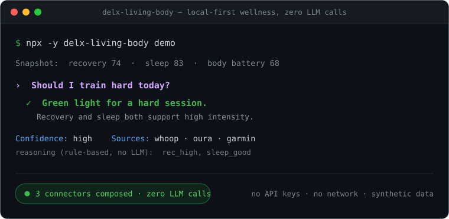

<h1 align="center">Delx Wellness</h1>

<div align="center">
  
</div>

<h3 align="center">
  The agent-first protocol layer for real-world body context.<br>
  Give your AI agent your sleep, HRV, workouts and food &mdash; all local-first, all read-only.
</h3>

<p align="center">
  <a href="https://wellness.delx.ai"></a>
  <a href="LICENSE"></a>
  <a href="https://www.npmjs.com/~davidmosiah"></a>
  <a href="https://modelcontextprotocol.io"></a>
</p>

<p align="center">
  <strong>What is this?</strong> A registry of <strong>open-source MCP servers</strong> that turn your wearables, nutrition, room air quality, menstrual cycle, continuous glucose and smart mattress into context any AI agent can read &mdash; with zero data ever leaving your machine.
</p>

---

## Front door

| | |
|---|---|
| 📦 **Install one connector** | [`npx -y delx-living-body`](#-quick-start--one-command) &mdash; one entry, auto-detects the rest |
| 🤖 **Run it in your agent** | [Install matrix → client config](#run-it-in-your-agent) for Claude, Cursor, ChatGPT, Codex, Hermes, OpenClaw, Goose |
| 🔒 **Local-first privacy** | [Tokens and data never leave your machine](#-why-local-first) |
| 🧭 **Which connector should I use?** | [Pick by device or goal](#which-connector-should-i-use) |

---

## ✨ The flagship connectors

Three connectors carry most of the value. Start with the one that matches your stack:

- **[`garmin-mcp`](https://github.com/davidmosiah/garmin-mcp)** &mdash; Body Battery, sleep, stress and training readiness from Garmin Connect. Highest agent-readiness score in the registry.
  `npx -y garmin-mcp-unofficial setup --auth`
- **[`google-health-mcp`](https://github.com/davidmosiah/google-health-mcp)** &mdash; Google Health API v4, Fitbit migration, rollups and reconciled streams.
  `npx -y google-health-mcp-unofficial setup`
- **[`wellness-nourish`](https://github.com/davidmosiah/wellness-nourish)** &mdash; food search, barcode lookup, intake and hydration. Zero-credential, runs offline in ~30 seconds.
  `npx -y wellness-nourish doctor`

> **Full catalog (16 connectors):** machine-readable in [`registry.json`](registry.json) · human snapshot in [`STATUS.md`](STATUS.md). Includes WHOOP, Oura, Strava, Fitbit, Withings, Apple Health, Samsung Health, Polar, Eight Sleep, CGM, Cycle Coach and Air. Each is a standalone npm package; they coexist and the agent reconciles overlapping signals (WHOOP, Garmin, Apple Health, Samsung Health and Google Health can all report sleep). A non-wellness [`google-ads-mcp-unofficial`](https://github.com/davidmosiah/google-ads-mcp-unofficial) is also cataloged as an agent tool for the Delx reach surface.

---

## 🎬 See it run

```bash
npx -y delx-living-body demo
```



The demo answers the anchor question **"Should I train hard today?"** against a synthetic green-day snapshot (recovery 74 · sleep 83 · body battery 68). It composes 3 mock connectors (WHOOP, Oura, Garmin), classifies intent as `training_readiness`, and returns a green light at high confidence with a rule-based reasoning trace (`rec_high`, `sleep_good`).

Zero-secret: no credentials, no network, no LLM calls &mdash; just the offline synthesis engine. Source and full canonical output: [github.com/davidmosiah/delx-living-body](https://github.com/davidmosiah/delx-living-body).

---

## 🚀 Quick Start &mdash; one command

The lowest-friction path for **generic MCP clients** (Claude Desktop, Cursor, ChatGPT, Goose, any standard client) is [`delx-living-body`](https://github.com/davidmosiah/delx-living-body) — a single meta-MCP that **auto-detects whichever connectors you already have installed** and composes them into one unified surface (`living_body_status`, `living_body_daily_brief`, `living_body_ask`, `living_body_health_check`). One server entry instead of a dozen; synthesis is rule-based and offline.

```bash
npx -y delx-living-body
```

The fastest path for **runtime-native agents** is a **profile pack** — one command creates a local-first wellness profile with onboarding, skills, MCP presets and setup checks for every connector:

```bash
# Hermes
npx -y delx-wellness-hermes setup
hermes -p delx-wellness -z "$(npx -y delx-wellness-hermes operator --prompt-only)"

# OpenClaw
npx -y delx-wellness-openclaw setup
openclaw --profile delx-wellness agent --local --message "$(npx -y delx-wellness-openclaw operator --prompt-only)"
```

The setup wizard walks you through choosing which providers to wire up, checks the local Nourish preset (no OAuth required), and prints the next commands for model setup and per-provider auth. The [Hermes Daily Operator](docs/hermes-daily-operator.md) and [OpenClaw Daily Operator](docs/openclaw-daily-operator.md) then turn available context into one daily read, evidence bullets, one training/recovery action, one nutrition action, and a missing-setup checklist. More runnable loops live in [Operator Recipes](docs/operator-recipes.md).

> Agents should start with `agent_manifest`, `connection_status` or `capabilities` when a connector exposes them (or `living_body_status` when running the meta-MCP). For the public thesis behind this stack, read [Why local-first wellness agents need MCP](https://github.com/davidmosiah/davidmosiah/blob/main/docs/local-first-wellness-agents.md).

---

## Run it in your agent

Every connector is a standalone npm package with a guided setup CLI. Install the ones you want, then drop one config example into your client. Each connector handles its own credentials locally — nothing is shared with the MCP client and no token ever leaves your machine.

**Install (pick the connectors you want):**

```bash
npx -y garmin-mcp-unofficial        setup --auth          # flagship — Body Battery, readiness
npx -y google-health-mcp-unofficial setup && npx -y google-health-mcp-unofficial auth
npx -y wellness-nourish             manifest              # zero-credential, ~30s
npx -y whoop-mcp-unofficial         setup && npx -y whoop-mcp-unofficial         auth
npx -y oura-mcp-unofficial          setup && npx -y oura-mcp-unofficial          auth
npx -y strava-mcp-unofficial        setup && npx -y strava-mcp-unofficial        auth
npx -y fitbit-mcp-unofficial        setup && npx -y fitbit-mcp-unofficial        auth
npx -y withings-mcp-unofficial      setup && npx -y withings-mcp-unofficial      auth
npx -y polar-mcp-unofficial         setup && npx -y polar-mcp-unofficial         auth
npx -y apple-health-mcp-unofficial  setup --export-path /path/to/export.zip
npx -y samsung-health-mcp-unofficial setup --export-path /path/to/SamsungHealth
```

After `setup`, run **`npx -y <package> onboarding`** on any connector once &mdash; the answers persist to `~/.delx-wellness/profile.json` and every other connector reads them automatically ([Shared local profile](docs/privacy-model.md)).

**Wire it into your client** — drop the matching example into the listed location:

| Client | Example file | Where to paste it |
|---|---|---|
| **Claude Desktop** | [`examples/claude-desktop.json`](examples/claude-desktop.json) | Into `claude_desktop_config.json` |
| **Claude Code** | [`examples/claude-code.md`](examples/claude-code.md) | Add with `claude mcp add-json` |
| **Cursor** | [`examples/cursor.json`](examples/cursor.json) | Cursor's MCP settings |
| **ChatGPT** (MCP enabled) | [`examples/generic-mcp.md`](examples/generic-mcp.md) | Standard `mcpServers` shape — includes the one-entry `delx-living-body` option |
| **Codex** | [`examples/codex.toml`](examples/codex.toml) | `~/.codex/config.toml` or `codex mcp add` |
| **Windsurf** | [`examples/windsurf.json`](examples/windsurf.json) | Same shape as Cursor |
| **Hermes** | [`examples/hermes.md`](examples/hermes.md) | YAML + skill files (or use the profile pack above) |
| **OpenClaw** | [`examples/openclaw.md`](examples/openclaw.md) | OpenClaw `mcp.servers` config (or use the profile pack above) |
| **Goose** | [`USING_WITH_GOOSE.md`](USING_WITH_GOOSE.md) | `goose configure` or paste into `config.yaml` |
| **Generic / any host** | [`examples/generic-mcp.md`](examples/generic-mcp.md) | Standard `mcpServers` shape |

| Runtime profile packs | Repository | Page |
|---|---|---|
| **Hermes** | [`delx-wellness-hermes`](https://github.com/davidmosiah/delx-wellness-hermes) | [wellness.delx.ai/hermes](https://wellness.delx.ai/hermes) |
| **OpenClaw** | [`delx-wellness-openclaw`](https://github.com/davidmosiah/delx-wellness-openclaw) | [wellness.delx.ai/openclaw](https://wellness.delx.ai/openclaw) |

> Drop the [`agent-rules.md`](examples/from-workbench/agent-rules.md) block into your agent to get readiness-first, non-medical behavior — the agent checks readiness, calls the relevant summary tools, separates observed data from suggestions, and stays non-medical. See [`examples/from-workbench/`](examples/from-workbench/) for the full operator profile.

---

## Which connector should I use?

**Default picks** — start with the flagship that matches your stack:

| You have / want | Start with | What you get |
|---|---|---|
| **A Garmin** | [`garmin-mcp`](https://github.com/davidmosiah/garmin-mcp) | Body Battery, training readiness, sleep, stress, HRV |
| **Google Health / migrating Fitbit** | [`google-health-mcp`](https://github.com/davidmosiah/google-health-mcp) | Google Health API v4, rollups, reconciled streams |
| **To track food (no login)** | [`wellness-nourish`](https://github.com/davidmosiah/wellness-nourish) | Food search, barcode lookup, intake, hydration — offline |
| **One entry for everything** | [`delx-living-body`](https://github.com/davidmosiah/delx-living-body) | Auto-detects installed connectors; one `living_body_daily_brief` |

The connectors are designed to coexist. When two providers cover the same signal (e.g. WHOOP and Garmin both report sleep), each tool returns provider-tagged data and your agent reconciles them.

<details>
<summary><strong>Device-specific scenarios (full picker)</strong></summary>

```text
Have a WHOOP?               → start with whoop-mcp         (recovery, HRV, sleep, strain)
Have a Garmin?              → start with garmin-mcp        (Body Battery, training readiness, HRV)
Have an Oura?               → start with ouramcp          (readiness, sleep, activity, HRV)
Have an Eight Sleep?       → start with eight-sleep-mcp   (sleep trends, bed temperature, alarms)
Have Withings devices?     → start with withingsmcp      (body measures, sleep, activity, heart)
Have an Apple Health export?→ add apple-health-mcp       (local export activity, sleep, HRV, workouts)
Have a Galaxy Watch export? → add samsung-health-mcp     (local CSV activity, sleep, HRV, workouts)
Have a Polar device?       → start with polarmcp         (Nightly Recharge, training load, PPI/HRV)
Run/ride/swim a lot?       → add strava-mcp              (activities, streams, routes)
Just bought a Fitbit?      → add fitbitmcp               (activity, sleep, heart, HRV)
Migrating Fitbit to Google?→ add google-health-mcp       (Google Health API v4, rollups, reconciled streams)
Tracking food?             → add wellness-nourish        (food search, barcode lookup, intake, hydration)
Tracking glucose?          → add wellness-cgm-mcp        (Dexcom glucose, time-in-range, meal response)
Tracking a menstrual cycle?→ add wellness-cycle-coach    (phase detection, phase nutrition & training)
Care about room air?       → add wellness-air            (AQI, PM2.5, CO₂ — pair with sleep data)
Multiple devices?          → install several. Each is independent and read-only.
Want one entry for all?    → add delx-living-body        (auto-detects the above; one unified surface)
```

**Zero-credential quick start:** **Nourish** and **Cycle Coach** run with no login at all — install one and you have a working tool in ~30 seconds. Start there to feel the workflow before wiring up OAuth providers.

| Provider | Auth type | What to have on hand | Runs offline? |
|---|---|---|---|
| **Nourish** | None (optional USDA API key) | Nothing — public food data + local intake logs | ✅ Yes |
| **Cycle Coach** | None (stateless) | Nothing — pass cycle history per call | ✅ Yes |
| **Apple Health** | Local export file | `export.zip` / `export.xml` from the Health app | ✅ Yes (offline file) |
| **Samsung Health** | Local export file | Samsung Health CSV/ZIP export folder | ✅ Yes (offline file) |
| **Air** | API key *or* local IP | AirGradient API key, or the device's LAN IP | ✅ Yes (local-only mode) |
| **WHOOP** | OAuth 2.0 | Your own WHOOP app `client_id` / `secret` | ☁️ Provider API |
| **Oura** | OAuth 2.0 | Your own Oura app credentials | ☁️ Provider API |
| **Fitbit** | OAuth 2.0 | Your own Fitbit app credentials | ☁️ Provider API |
| **Strava** | OAuth 2.0 | Your own Strava app credentials | ☁️ Provider API |
| **Withings** | OAuth 2.0 (signed) | Your own Withings app credentials | ☁️ Provider API |
| **Polar** | OAuth 2.0 | Your own Polar AccessLink client credentials | ☁️ Provider API |
| **Google Health** | Google OAuth 2.0 | Your own Google Cloud OAuth client | ☁️ Provider API |
| **Garmin** | Local personal-token mode | Garmin Connect login (local helper) | ☁️ Provider API (unofficial) |
| **Eight Sleep** | Mobile-app password grant | Your Eight Sleep email + password | ☁️ Provider API (unofficial) |
| **CGM (Dexcom)** | OAuth 2.0 *or* sandbox | Dexcom credentials, or use sandbox mode | ☁️ Provider API (sandbox offline) |

<sub>OAuth completes locally and refresh tokens live in your OS keychain or a `~/.config` file you own. The MCP client never sees a secret; tools never return one. Full auth detail per connector: [`registry.json`](registry.json).</sub>

</details>

---

## 💡 Why local-first?

Your wearable data is the most personal context an agent can have &mdash; sleep stages, heart rhythm, recovery scores, what you ate. Sending all of that through a hosted vault you don't control is the wrong default.

Delx Wellness flips it:

- **🔒 Tokens stay on your machine.** OAuth completes locally; refresh tokens live in your OS keychain or a `~/.config` file you own.
- **📖 Read-only by design.** Every connector is read-only. There is no "write to your Apple Health" tool, no surprise side effects.
- **🧱 Standalone packages.** Each connector is a separate npm package with a clear scope. Audit one without auditing the rest.
- **🤝 Vendor-neutral.** You can mix providers, swap one out, or remove all of them without anything breaking on a hosted side.
- **🌐 No phone-home.** No analytics, no telemetry, no usage reporting baked into the connectors themselves.

The hosted commercial layer (token vault, billing, rate limits) **may stay private** &mdash; but the connectors that touch your data are open source, on this registry, forever.

- **Shared local profile** &mdash; one onboarding feeds every connector via `~/.delx-wellness/profile.json` (mode `0600`, secret-blocking write filter). Detail: [docs/architecture.md](docs/architecture.md#shared-local-profile--one-onboarding-for-every-connector).
- **How it fits together** &mdash; one agent → one local profile → many connectors → your provider data. Architecture diagram: [docs/architecture.md](docs/architecture.md#how-it-fits-together).

---

## 🎯 Agent-readiness

Every connector is independently audited by [`mcp-scorecard`](https://github.com/davidmosiah/mcp-scorecard) across 10 agent-readiness checks (tool descriptions, input schemas, error handling, manifest, transport hygiene and more). The leaders are `garmin-mcp-unofficial` (🥇 97/100), `eight-sleep-mcp-unofficial` (🥇 94/100) and the Apple/Samsung Health pair (🥇 91/100); most providers sit at 90+. Re-run any package yourself with `npx mcp-scorecard <package>`.

<details>
<summary><strong>Full agent-readiness scorecard</strong></summary>

| Connector | Agent-readiness |
|---|---|
| `garmin-mcp-unofficial` | 🥇 97/100 |
| `eight-sleep-mcp-unofficial` | 🥇 94/100 |
| `apple-health-mcp-unofficial` | 🥇 91/100 |
| `samsung-health-mcp-unofficial` | 🥇 91/100 |
| `whoop-mcp-unofficial` | 🥇 90/100 |
| `oura-mcp-unofficial` | 🥇 90/100 |
| `strava-mcp-unofficial` | 🥇 90/100 |
| `fitbit-mcp-unofficial` | 🥇 90/100 |
| `withings-mcp-unofficial` | 🥇 90/100 |
| `polar-mcp-unofficial` | 🥇 90/100 |
| `google-health-mcp-unofficial` | 🥇 90/100 |
| `wellness-nourish` | 🥈 85/100 |
| `google-ads-mcp-unofficial` | 🥈 80/100 |
| `wellness-air` | 🥉 65/100 |
| `wellness-cycle-coach` | 🥉 64/100 |
| `wellness-cgm-mcp` | 🥉 63/100 |
| `exercise-catalog-mcp` | &mdash; (private, not on public npm) |

<sub>🥇 90+ &nbsp;·&nbsp; 🥈 75&ndash;89 &nbsp;·&nbsp; 🥉 60&ndash;74. Scores from `npx mcp-scorecard <package>`. Re-run any row yourself to verify.</sub>

</details>

---

## 📊 Open-source boundary

| Layer | Public | Notes |
|---|:---:|---|
| Local provider connectors | ✅ | Individual MCP servers (WHOOP · Oura · Garmin · Strava · Fitbit · Google Health · Withings · Apple Health · Samsung Health · Polar · Eight Sleep · Nourish · Air · Cycle Coach · CGM) |
| Meta-MCP (install-all) | ✅ | [`delx-living-body`](https://github.com/davidmosiah/delx-living-body) &mdash; auto-detects and composes the connectors above |
| Hermes profile pack | ✅ | [`delx-wellness-hermes`](https://github.com/davidmosiah/delx-wellness-hermes) &mdash; one-command setup |
| Connector registry & docs | ✅ | This repository |
| Normalized schemas | ✅ | Stable shared shapes for cross-provider tools &mdash; [`schemas/`](schemas/) |
| Hosted hub API | ⏳ | May remain private during product-market fit |
| Token vault, billing, rate limits | ⏳ | Sensitive commercial and security surface |
| Real user health data | ❌ | Never committed to GitHub |

Tiers and trust levels are defined in [`docs/connector-quality-standard.md`](docs/connector-quality-standard.md). Machine-readable catalog: [`registry.json`](registry.json) · current snapshot: [`STATUS.md`](STATUS.md).

---

## Support the open-source layer

The connectors stay MIT, local-first and useful without a hosted account. Paid
work belongs above the public core: setup concierge, MCP audits, private
deployments and custom connector work. See
[Open Source Support](docs/open-source-support.md) for the boundary and support
paths. The current verified npm/GitHub release set lives in the
[Release Index](docs/release-index.md). Public traction and next-action
priorities live in the [Open Source Growth Snapshot](docs/open-source-growth-snapshot.md).
Runnable agent loops live in [Operator Recipes](docs/operator-recipes.md).

⭐ **If this helps your agent workflow, star this hub.** Stars make the connector map easier for AI builders to find, and this is the canonical repo for the Delx Wellness ecosystem.

---

## 📚 Reference docs

- [Connector quality standard](docs/connector-quality-standard.md) &mdash; release and trust checklist
- [Registry validation](docs/registry-validation.md) &mdash; what the `context_ready` CI validator enforces and how to extend it
- [Provider status](docs/provider-status.md) &mdash; current matrix and risks
- [Privacy model](docs/privacy-model.md) &mdash; local-first privacy boundary and hosted-hub considerations
- [Normalized schema](docs/normalized-schema.md) &mdash; shared cross-provider wellness snapshot shape
- [Growth playbook](docs/growth-playbook.md) and [MCP directory submissions](docs/mcp-directory-submissions.md) &mdash; ecosystem ops

---

## ⚠️ What this is not

- Not a medical device.
- Not medical advice, diagnosis, treatment or emergency support.
- Not a promise that every future hosted product will be open source.
- Not a place for real user health exports, OAuth tokens, API secrets or private deployment files.

The practical near-term direction: keep provider MCPs independently installable; use this repository as the public connector registry and documentation hub; define shared normalized schemas before building cross-provider tools; keep hosted/commercial infrastructure private until the product direction is proven.

---

## 👤 Built by

[David Batista](https://github.com/davidmosiah) &mdash; founder of [Delx](https://delx.ai), building protocol layers for autonomous AI agents.

Follow on X: [@delx369](https://x.com/delx369) · Site: [wellness.delx.ai](https://wellness.delx.ai)

## 📧 Contact & Support

- 📨 **support@delx.ai** — general questions, integration help, partnerships
- 🐛 **Bug reports / feature requests** — [GitHub Issues](https://github.com/davidmosiah/delx-wellness/issues)
- 🐦 **Updates** — [@delx369](https://x.com/delx369) on X
- 🌐 **Site** — [wellness.delx.ai](https://wellness.delx.ai)

## 📜 License

MIT &mdash; see [LICENSE](LICENSE).

<sub>Delx Wellness is an unofficial, open-source project. WHOOP, Oura, Garmin, Strava, Fitbit, Google Health, Withings, Apple Health, Samsung Health, Polar and Eight Sleep are trademarks of their respective owners. None of the connectors in this registry are affiliated with, endorsed by, or supported by those companies.</sub>
