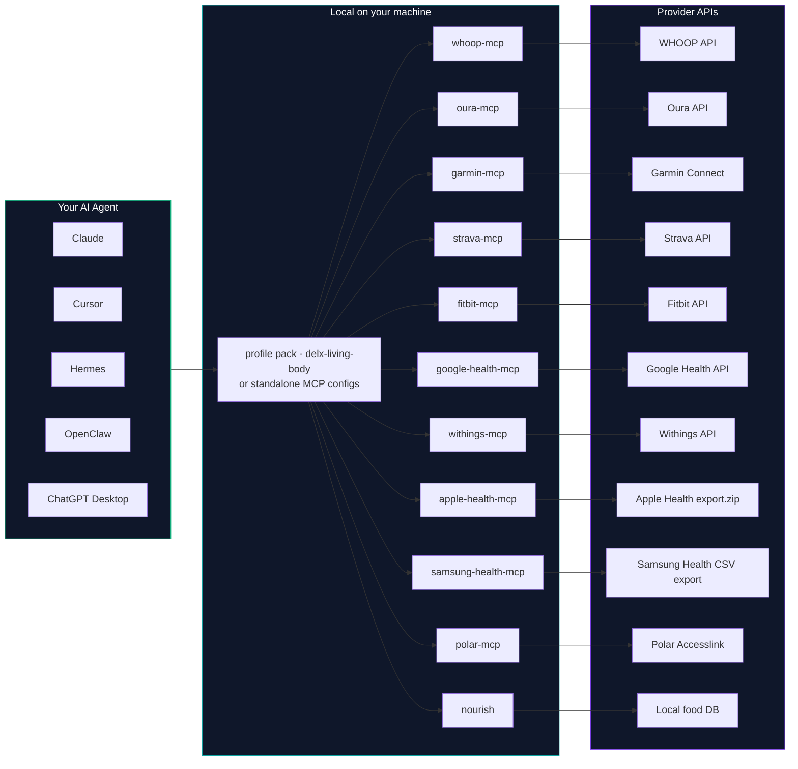

# Architecture & shared local profile

How the Delx Wellness pieces fit together, and how one onboarding feeds every connector. This page holds the detail that used to live inline in the [README](../README.md) so the front door stays light.

## How it fits together



_One agent &rarr; one local profile &rarr; many connectors &rarr; your provider data. **Tokens never leave your machine.**_

## Shared local profile — one onboarding for every connector

As of **v0.4.0** every connector reads and writes the same local profile at **`~/.delx-wellness/profile.json`** (mode `0600`). Onboarding once tells your agent your name, gender, age, height, weight, goals, devices, training level, dietary patterns, language, units and reply style &mdash; and **every connector instantly uses it** for personalized summaries, coaching and unit conversion.

```bash
npx -y whoop-mcp-unofficial    onboarding
npx -y wellness-nourish        onboarding pt-BR
npx -y garmin-mcp-unofficial   onboarding
```

Or call the MCP tools from inside your agent:

| Tool | What it does |
|---|---|
| `<vendor>_onboarding` | Returns the 11-question flow (EN or pt-BR) the agent walks through with the user |
| `<vendor>_profile_get` | Reads `~/.delx-wellness/profile.json` &mdash; returns the structured profile + a friendly summary |
| `<vendor>_profile_update` | Patches the profile (gated on `explicit_user_intent: true`) |

**Privacy contract:**

- 🏠 **Single canonical path** &mdash; `~/.delx-wellness/profile.json`, owned by your user, never uploaded.
- 🔒 **Secret-blocking write filter** &mdash; the schema rejects fields matching `oauth | token | secret | password | cookie | refresh | api[_-]?key | session` so the profile can never accidentally hold a credential.
- 🧱 **Vendored library, not an external dependency** &mdash; each connector ships its own copy of the profile-store code. No central package to install, no npm dependency graph creep.
- 🔁 **Auto-migration** &mdash; on first read, the store imports any existing profile from `~/.hermes/profiles/delx-wellness/wellness-profile.json` or `~/.openclaw-delx-wellness/workspace/wellness-profile.json` so Hermes and OpenClaw users keep their existing answers.
- ✋ **Write intent gate** &mdash; profile updates require `explicit_user_intent: true`. Agents that try to write without it get a `USER_ACTION_REQUIRED` response.

> Schema: [`delx-wellness/lib/profile-store.ts`](../lib/profile-store.ts) is the canonical source. Every connector vendors a byte-for-byte copy so the ecosystem stays self-contained.
